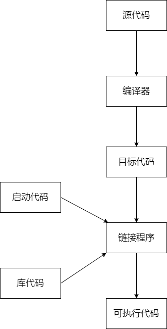

# 第一课 How the C++ Compiler Works
从文本到可执行文件，需要经过两个步骤：一是compiling(编译)；二是linking（链接）。本章只记录compiling。

compiling工作流程：
1. pre-process(预处理)
   在预编译期间，编译器会检查所有pre-processing语句并进行评估。
2. tokenizing(标记解释)
3. parsing(解析)

基本上结果就是创建叫做abstract syntax tree(抽象语法树)，也就是我们代码的表达，但是是以抽象语法树的形式来进行表示。
总的来说 编译器的工作就是将代码转化成constant data(常量数据)，要么是instructions(指令)。
项目里的每个cpp都会被编译器编译成一个obj，这些cpp文件也叫translation unity(编译单元).
`#define`为预处理语句，会将之后的词进行搜索，然后替换成后面的词，例如`#define INTEGE int`。
