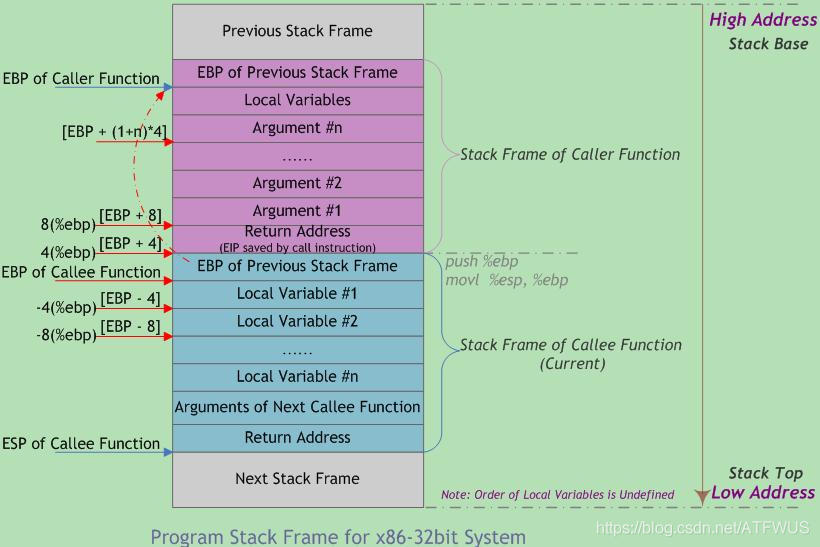

# functions in C++
## 函数基础
function基本上是我们编写的代码块，他们被设计用来执行某个特定的任务。分割函数避免重复，可以在代码中进行多次调用。

函数包括：返回值，函数名，(指定参数)，函数体。例如：
```
int Multiply(int a, int b){
    
    return a * b;

}
```
函数可以在程序中直接调用。
在一个运行中的的程序中，为了调用一个函数，我们需要为这个函数创建一整个stack frame(栈帧)，下面为详细介绍。
## 栈在计算机中的应用
+ 在计算机系统中，栈也可以称之为栈内存，是一个具有内存区域，存储函数内部(包括main函数)的局部变量和方法调用以及函数参数值，是有系统自动分配的，一般速度较快；存储地址是连续且存在有限栈容量，会出现溢出现象，程序可以将数据压入栈中，也可以将数据从栈顶弹出。压栈操作使得栈增大，二弹出操作使栈缩小。
+ 栈用于维护函数调用的上下文，离开了栈，函数调用你就没法实现。
+ 栈是从高地址向低地址延伸。
## 栈帧
每一次函数的调用，都会在栈(call stack)上维护一个独立的栈帧(stack frame)。
一个函数的栈帧用ebp和esp这两个寄存器来划定范围。
栈帧包括：
1. 函数的返回地址和参数。
2. 临时变量。包括函数的非静态局部变量以及编译器自动生成的其他临时变量。
3. 栈帧状态值：ebp(帧指针)，指向当前的栈帧的底部；esp(栈指针)始终指向栈帧的顶部；

栈帧从低到上依次是（是高地址到低地址的方向）：
1. 参数
2. 返回地址
3. ebp
4. 局部变量
5. esp
   
## 函数的调用过程
### 调用约定:
+ 函数调用约定描述了函数传递参数方式和栈帧同工作的技术细节。不同的操作系统、不同的语言、不同的编译器在实现函数调用时的原理虽软基本相同，但具体的调用约定还是有差别的。这包括参数传递方式，餐朱入栈顺序是从右向左还是从左向右，函数返回时恢复堆栈平衡的操作在子函数中进行还是在母函数中进行。
+ 同一段大妈用不同的编译选项、不同的编译器编译链接后，得到的可执行文件会有很多不同。
### 调用过程
1. 参数入栈。将参数按照一定的顺序入栈。
2. 返回地址入栈。将当前代码区调用指令的下一条指令地址压入栈中，供函数返回时继续执行。
3. 代码区跳转。处理器从当前代码区跳转到被调用函数的入口处。
4. 栈帧处理步骤：ebp入栈，保存当前栈帧状态值，以备后面回复本栈帧是使用。push ebp
5. 栈帧处理步骤：ESP值赋给EBP，更新栈帧底部。mov ebp，esp
6. 栈帧处理步骤：给新栈帧分配空间。sub esp ,xxx
## 函数返回过程
1. 保存被调用函数的返回值到eax寄存器中。mov eax, xxx
2. 恢复esp通知回收局部变量空间。mov esp, ebp
3. 将当前栈帧底部保存的前栈帧EBP值弹入EBp寄存器中，恢复出上一个栈帧。pop ebp
4. 弹出当前栈顶元素，从栈中取到返回地址，并跳转到该位置 ret
## 图示 

## 函数基础-2
在主函数中，默认返回0